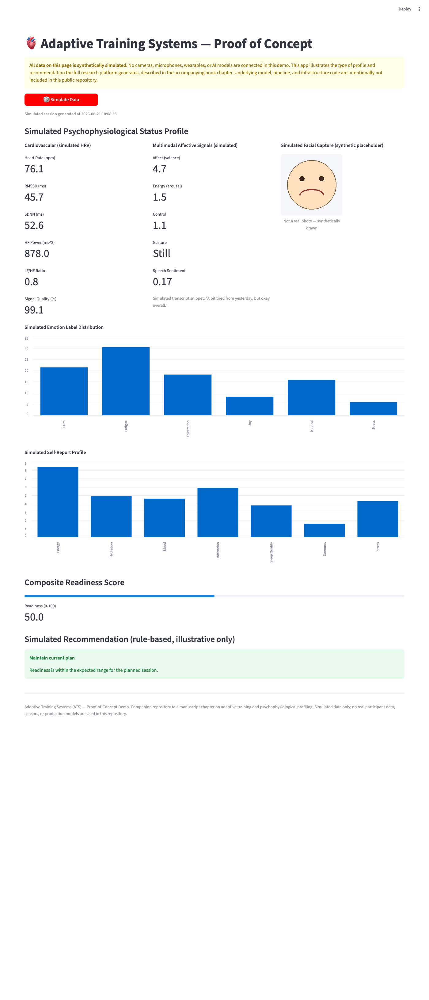

# Adaptive Training Systems (ATS) — Proof of Concept

A minimal, public **proof-of-concept demo** accompanying a book chapter on
adaptive training and psychophysiological profiling.

## What this is

A single-page app with one button, **Simulate Data**, that generates a
randomly simulated pre-session profile (heart rate variability, multimodal
affective signals, a self-report survey, and a synthetic facial-capture
placeholder) and displays an illustrative, rule-based training
recommendation derived from that simulated profile.

## What this is not

- No cameras, microphones, or wearable devices are connected.
- No real AI/ML models are called (the recommendation logic here is a
  simple, transparent rule of thumb for illustration only).
- No participant data of any kind is collected, stored, or transmitted.
- This repository does not include the data pipelines, model training
  code, or infrastructure of the full research platform.

Every value shown is generated with a random-number generator, within
plausible physiological ranges, purely to illustrate the *type* of output
the full system produces.

## Preview



## Running the demo

```bash
pip install -r requirements.txt
streamlit run app.py
```

Then open the local URL Streamlit prints in your terminal, and click
**Simulate Data**.

## License

MIT — see [LICENSE](LICENSE).
